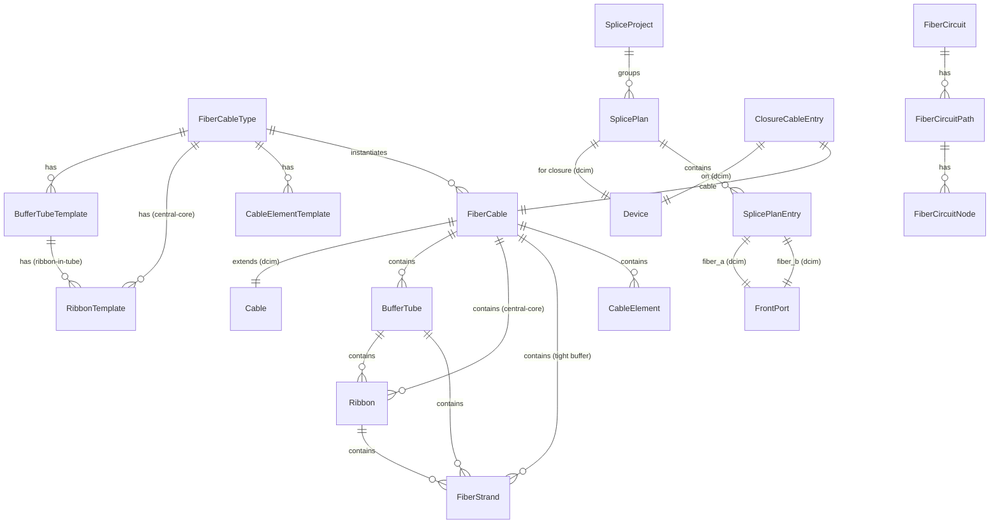
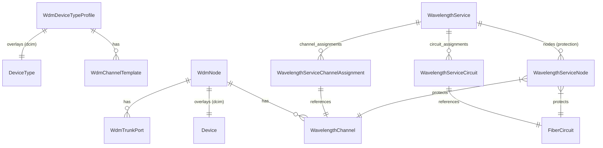

# Architecture

This document describes the internal architecture of the NetBox FMS plugin. It is
intended for developers who want to understand, extend, or contribute to the
codebase.

## Data Model Hierarchy

NetBox FMS follows the same **Type/Instance pattern** used by NetBox's own
`DeviceType` / `Device` relationship. A `FiberCableType` acts as a blueprint that
defines cable construction and component templates. When a `FiberCable` instance is
created, it reads those templates and auto-instantiates the corresponding physical
components.

### Model Groups

Models are organized into four functional groups:

#### 1. Type-level (blueprints)

These models define the construction of a fiber cable without representing a
physical instance.

| Model | Purpose |
|-------|---------|
| `FiberCableType` | Top-level blueprint. Defines fiber count, jacket color, cable type, and owns component templates. Counter-cached instance count via `connect_counters()`. |
| `BufferTubeTemplate` | Template for a buffer tube within a cable type. Specifies fiber count or holds child `RibbonTemplate` entries. |
| `RibbonTemplate` | Template for a fiber ribbon. Can be a child of a `BufferTubeTemplate` (ribbon-in-tube) or directly on a `FiberCableType` (central-core ribbon). |
| `CableElementTemplate` | Template for non-fiber elements such as strength members or messenger wires. |

#### 2. Instance-level

Created automatically by `FiberCable._instantiate_components()` when a new
`FiberCable` is saved. Four construction cases are supported:

| Case | Structure |
|------|-----------|
| **Loose tube** | `BufferTube` with `FiberStrand` children |
| **Ribbon-in-tube** | `BufferTube` -> `Ribbon` -> `FiberStrand` |
| **Central-core ribbon** | `Ribbon` (on cable) -> `FiberStrand` |
| **Tight buffer** | `FiberStrand` directly on cable |

| Model | Purpose |
|-------|---------|
| `FiberCable` | Instance linked one-to-one with a `dcim.Cable`. Triggers component instantiation on creation. |
| `BufferTube` | Physical buffer tube within a cable. |
| `Ribbon` | Fiber ribbon, either inside a tube or directly in a cable. |
| `FiberStrand` | Individual fiber strand. Automatically assigned EIA/TIA-598 colors. |
| `CableElement` | Non-fiber element instance (strength member, tracer wire, etc.). |

#### 3. Splice planning

| Model | Purpose |
|-------|---------|
| `SpliceProject` | Groups related splice plans for project-level organization. |
| `SplicePlan` | A splice plan for a specific closure (`dcim.Device`). Tracks diff staleness for cache invalidation. |
| `SplicePlanEntry` | Maps one `dcim.FrontPort` (fiber_a) to another `dcim.FrontPort` (fiber_b), representing a planned splice. |
| `ClosureCableEntry` | Records which `FiberCable` instances enter a closure (`dcim.Device`). |
| `SlackLoop` | Tracks slack loop storage at a closure. |

#### 4. Fiber circuits

| Model | Purpose |
|-------|---------|
| `FiberCircuit` | End-to-end logical circuit spanning multiple fiber segments and splices. |
| `FiberCircuitPath` | One contiguous path (A-to-Z direction or protection path) within a circuit. |
| `FiberCircuitNode` | An ordered node within a path, referencing the specific fiber strand and device traversed. |

#### 5. WDM (Wavelength-Division Multiplexing)

WDM models follow the same **overlay pattern** used by the rest of the plugin:
a profile is attached to a `dcim.DeviceType` (blueprint), and a node is attached
to a `dcim.Device` (instance). This keeps core NetBox models untouched while
layering WDM semantics on top.

| Model | Purpose |
|-------|---------|
| `WdmDeviceTypeProfile` | One-to-one overlay on `dcim.DeviceType`. Declares the device type's WDM capability (`node_type`) and channel grid (`grid`). Owns `WdmChannelTemplate` children. |
| `WdmChannelTemplate` | Defines a channel slot on the profile. Each template specifies a `grid_position`, `wavelength_nm`, `label`, and optional `FrontPortTemplate` link. |
| `WdmNode` | One-to-one overlay on `dcim.Device`. On creation (except for amplifiers), `_auto_populate_channels()` reads the device type's `WdmDeviceTypeProfile` templates and bulk-creates `WavelengthChannel` instances, resolving `FrontPortTemplate` names to live `FrontPort` objects. |
| `WdmTrunkPort` | Maps a `dcim.RearPort` on the device to a directional trunk (e.g., East/West). Used by the apply-mapping logic to create `PortMapping` rows that connect channel `FrontPort` positions to trunk `RearPort` positions. |
| `WavelengthChannel` | A wavelength channel instance on a `WdmNode`. Tracks `grid_position`, `wavelength_nm`, optional `front_port` assignment, and a `status` (available / reserved / lit). The `grid_position` maps directly to the `rear_port_position` in `PortMapping`, aligning each channel to the correct position in the cable profile's position stack. |
| `WavelengthService` | End-to-end wavelength service spanning one or more fiber circuits and WDM nodes. Lifecycle transitions (decommission) automatically release channels and delete protection nodes. |
| `WavelengthServiceCircuit` | Through-model linking a `WavelengthService` to `FiberCircuit` instances in sequence order. |
| `WavelengthServiceChannelAssignment` | Through-model linking a `WavelengthService` to `WavelengthChannel` instances in sequence order. |
| `WavelengthServiceNode` | Relational index for PROTECT-based deletion prevention. Each row references exactly one of `WavelengthChannel` or `FiberCircuit` (enforced by a `CheckConstraint`). Prevents deletion of channels or circuits that are part of an active service. |

**Grid position and the cable profile position stack.** Each `WavelengthChannel`
has a `grid_position` that corresponds to an ITU-T channel number. When a channel
is mapped to a `FrontPort` via the apply-mapping endpoint, the system creates
`PortMapping` rows where `rear_port_position = grid_position`. This aligns the
WDM channel to the correct fiber position within the cable profile, so that the
trace engine can walk through the WDM node just as it walks through any other
device with port mappings.

**Protection model.** `WavelengthServiceNode` rows act as relational guards.
When a `WavelengthService` is active, its nodes hold PROTECT foreign keys to the
referenced channels and circuits. Attempting to delete a channel or circuit that
is part of an active service raises a `ProtectedError`. On decommission, the
service's `save()` method deletes all nodes and releases channels back to
`available` status.

## Service Layer

Business logic is separated from Django model methods into dedicated service
modules.

### `services.py` -- Splice plan computation and cable topology

- **`compute_diff(plan)`** -- Compares the desired splice state (from
  `SplicePlanEntry` records) against the live state (actual `PortMapping` entries
  in NetBox) and returns a per-tray breakdown of additions, removals, and unchanged
  splices.
- **`get_live_state(closure)`** / **`get_desired_state(plan)`** -- Query helpers
  that feed `compute_diff()`.
- **`apply_diff(plan)`** -- Applies the computed diff to NetBox's `PortMapping`
  table, creating and deleting mappings as needed.
- **`import_live_state(plan)`** -- Imports the current live splice state into a
  plan's entries for documentation purposes.
- **`link_cable_topology(cable, fiber_cable_type, device, ...)`** -- Atomic
  transaction that creates a `FiberCable`, adopts or creates `FrontPort`/`RearPort`
  pairs on the device, and sets the cable profile.
- **`propose_port_mapping()`** -- Builds a position-based mapping from strand
  positions to `FrontPort` instances for confirmation before linking.

### `provisioning.py` -- DAG-based fiber circuit provisioning

- **`find_fiber_paths(origin, destination, strand_count, ...)`** -- BFS/DFS
  pathfinding over a device-connectivity graph. Discovers all available fiber
  routes between two devices, scores candidates by configurable priorities, and
  returns ranked proposals.
- **`create_circuit_from_proposal(proposal, ...)`** -- Transactional factory that
  creates a `FiberCircuit`, its `FiberCircuitPath`, and ordered
  `FiberCircuitNode` entries from a selected proposal.
- Internal helpers build the device adjacency graph, compute per-hop strand
  availability matrices, and chain multi-hop candidates.

### `trace.py` -- Fiber path trace engine

- **`trace_fiber_path(origin_front_port)`** -- Starting from a `FrontPort`,
  navigates the chain: FrontPort -> PortMapping -> RearPort -> CableTermination ->
  Cable -> far-end RearPort -> PortMapping -> FrontPort, repeating until the path
  terminates or a splice (`SplicePlanEntry`) redirects to another fiber. Returns
  the full path with completeness status.

### `export.py` -- Draw.io diagram generation

- **`generate_drawio(plan)`** -- Creates mxGraph XML for a splice plan. Each
  splice tray becomes a separate page/tab in the diagram. Fibers are colored using
  EIA/TIA-598 codes, and diff annotations (add/remove/unchanged) are applied to
  splice connections.

### `constants.py` -- EIA/TIA-598 color palette

- **`EIA_598_COLORS`** -- Tuple of 12 `(hex_color, name)` pairs following the
  EIA/TIA-598 standard fiber color code (Blue, Orange, Green, Brown, Slate, White,
  Red, Black, Yellow, Violet, Rose, Aqua).
- **`get_eia598_color(position)`** -- Returns the color tuple for a 1-indexed
  fiber position, cycling through the 12-color palette for positions beyond 12.

### `cable_profiles.py` -- High-count fiber cable profiles

NetBox's built-in cable profiles cap at 16 positions (`Single1C16P`). Fiber plant
cables commonly have far more strands. This module defines `BaseCableProfile`
subclasses for 24, 48, 72, 96, 144, 216, 288, and 432 strand counts, allowing the
trace algorithm to route at the individual strand level through high-count fiber
trunk cables.

## Signal Handlers

### `signals.py`

Registered via `connect_signals()` in `PluginConfig.ready()`.

- **`cable_post_save`** -- On `dcim.Cable` save, checks whether the cable
  terminates on `FrontPort` instances belonging to a closure with a `SplicePlan`.
  If so, marks the plan's diff as stale (`diff_stale=True`) so it will be
  recomputed on next access.
- **`cable_pre_delete`** -- Same invalidation logic, but on `pre_delete` (before
  cascade removes the termination records needed for the device lookup).

## Template Content Injection

### `template_content.py`

Uses NetBox's `PluginTemplateExtension` system to inject content into core NetBox
detail views.

- **`CableFiberCablePanel`** -- Adds a panel to the `dcim.Cable` detail page
  showing the associated `FiberCable` instance, its type, and tube count. Only
  renders when a `FiberCable` is linked to the cable.

## Plugin Registration

### `__init__.py`

The `NetBoxFMSConfig` class (subclass of `PluginConfig`) serves as the plugin
entry point.

| Setting | Value |
|---------|-------|
| `base_url` | `"fms"` |
| `min_version` | `"4.5.0"` |

The `ready()` method performs two setup actions:

1. **`connect_signals()`** -- Registers the `post_save` and `pre_delete` handlers
   for `dcim.Cable` described above.
2. **`connect_counters(FiberCableType)`** -- Enables NetBox's built-in counter
   cache so that `FiberCableType` tracks how many `FiberCable` instances reference
   it without requiring a count query on every list view.
