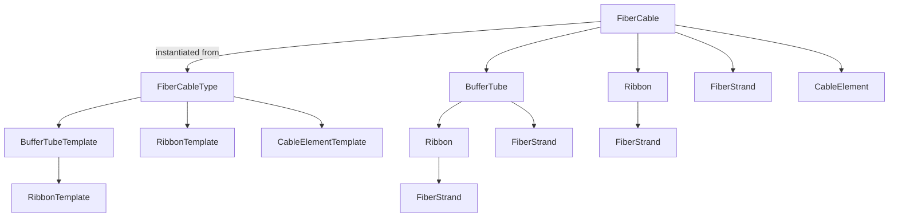
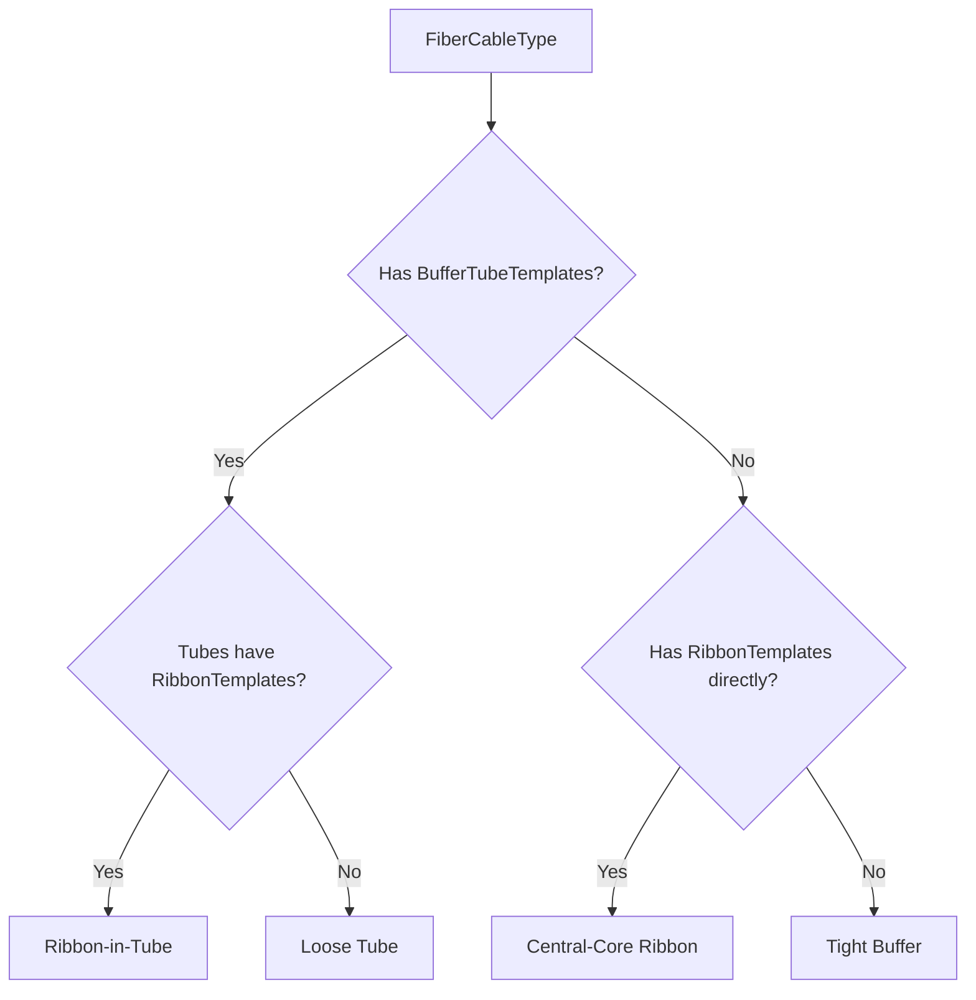
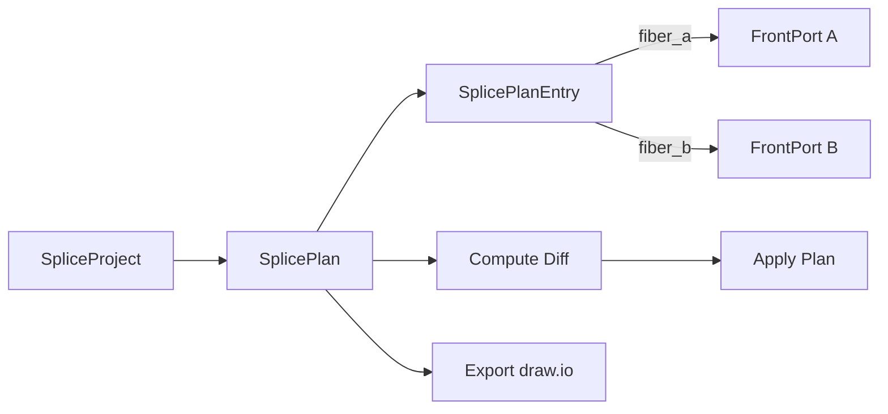
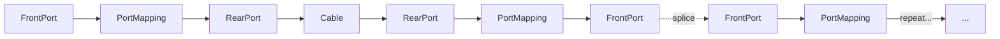

# NetBox FMS Documentation Site Implementation Plan

> **For agentic workers:** REQUIRED: Use superpowers:subagent-driven-development (if subagents available) or superpowers:executing-plans to implement this plan. Steps use checkbox (`- [ ]`) syntax for tracking.

**Goal:** Build a comprehensive Zensical-powered documentation site for the netbox-fms plugin, covering installation, user workflows, developer architecture, and reference material.

**Architecture:** Static documentation site using Zensical (Rust/Python SSG from Material for MkDocs team). Config in `docs/zensical.toml`, markdown content in `docs/`, Mermaid diagrams for visuals. Existing `docs/superpowers/` excluded from site navigation.

**Tech Stack:** Zensical, Markdown, Mermaid diagrams

---

## File Structure

All files are new. No existing files are modified except `pyproject.toml` and `Makefile`.

| File | Responsibility |
|------|---------------|
| `docs/zensical.toml` | Site config: name, repo, nav, theme, mermaid |
| `docs/index.md` | Landing page: overview, features, quick links |
| `docs/getting-started/installation.md` | pip install, PLUGINS config, migrations |
| `docs/getting-started/configuration.md` | Plugin settings, permissions |
| `docs/getting-started/quickstart.md` | End-to-end walkthrough |
| `docs/user-guide/concepts.md` | Type/Instance pattern, construction cases, EIA-598 |
| `docs/user-guide/fiber-cable-types.md` | Cable type management |
| `docs/user-guide/fiber-cables.md` | Cable creation, auto-instantiation, topology linking |
| `docs/user-guide/splice-planning.md` | SpliceProject, plans, entries, diff, draw.io |
| `docs/user-guide/fiber-circuits.md` | Provisioning, tracing, loss budgets |
| `docs/user-guide/device-fiber-overview.md` | Device tab, closure cable entries, glands |
| `docs/developer/architecture.md` | Data models, service layer, signals |
| `docs/developer/api-examples.md` | Curated REST/GraphQL examples |
| `docs/developer/contributing.md` | Dev env, tests, adding models |
| `docs/reference/choices.md` | All ChoiceSet values |
| `docs/reference/cable-profiles.md` | Strand-to-profile mapping |
| `pyproject.toml` | Update `[project.optional-dependencies] docs` |
| `Makefile` | Add `docs` and `docs-serve` targets |

---

### Task 1: Project Scaffolding — Zensical Config & Dependencies

**Files:**
- Create: `docs/zensical.toml`
- Modify: `pyproject.toml:44-47`
- Modify: `Makefile:126` (add docs section before Help)

- [ ] **Step 1: Update pyproject.toml docs dependencies**

Replace the `docs` optional dependency group:

```toml
docs = [
    "zensical",
]
```

- [ ] **Step 2: Create `docs/zensical.toml`**

```toml
[project]
site_name = "NetBox FMS"
site_url = "https://jsenecal.github.io/netbox-fms/"
site_description = "Fiber cable management, splice planning, and circuit provisioning for NetBox"
site_author = "Jonathan Senecal"
repo_url = "https://github.com/jsenecal/netbox-fms"
repo_name = "jsenecal/netbox-fms"
edit_uri = "edit/main/docs/"

[project.theme]
features = [
  "content.action.edit",
  "content.action.view",
]

[project.theme.icon]
repo = "fontawesome/brands/github"

[[project.nav]]
"Getting Started" = [
  { "Installation" = "getting-started/installation.md" },
  { "Configuration" = "getting-started/configuration.md" },
  { "Quickstart" = "getting-started/quickstart.md" },
]

[[project.nav]]
"User Guide" = [
  { "Core Concepts" = "user-guide/concepts.md" },
  { "Fiber Cable Types" = "user-guide/fiber-cable-types.md" },
  { "Fiber Cables" = "user-guide/fiber-cables.md" },
  { "Splice Planning" = "user-guide/splice-planning.md" },
  { "Fiber Circuits" = "user-guide/fiber-circuits.md" },
  { "Device Fiber Overview" = "user-guide/device-fiber-overview.md" },
]

[[project.nav]]
"Developer" = [
  { "Architecture" = "developer/architecture.md" },
  { "API Examples" = "developer/api-examples.md" },
  { "Contributing" = "developer/contributing.md" },
]

[[project.nav]]
"Reference" = [
  { "Choice Values" = "reference/choices.md" },
  { "Cable Profiles" = "reference/cable-profiles.md" },
]
```

> **Note:** Zensical's nav syntax may differ from this TOML representation. Consult `zensical.org/docs/setup/navigation/` and adjust if needed. Zensical can also read `mkdocs.yml` format natively — if the TOML nav proves problematic, fall back to an `mkdocs.yml` config.

- [ ] **Step 3: Add Makefile targets**

Add before the `# Help` section in `Makefile`:

```makefile
# ---------------------------------------------------------------------------
# Documentation
# ---------------------------------------------------------------------------

.PHONY: docs
docs: ## Build documentation site
	cd docs && zensical build

.PHONY: docs-serve
docs-serve: ## Serve documentation with live reload
	cd docs && zensical serve
```

- [ ] **Step 4: Commit**

```bash
git add docs/zensical.toml pyproject.toml Makefile
git commit -m "docs: scaffold Zensical documentation site"
```

---

### Task 2: Landing Page

**Files:**
- Create: `docs/index.md`

- [ ] **Step 1: Write `docs/index.md`**

Content should include:
- Project name and one-line description: "Fiber cable management, splice planning, and circuit provisioning for NetBox"
- Version badge (v0.1.0)
- Feature highlights (4-5 bullets):
  - Cable type blueprints with auto-instantiation (Device/DeviceType pattern)
  - Four construction cases: loose tube, ribbon-in-tube, central-core ribbon, tight buffer
  - Splice planning with diff computation and draw.io export
  - Fiber circuit provisioning with DAG-based pathfinding
  - Device fiber overview with closure management
- Quick links grid to Getting Started, User Guide, Developer, Reference sections
- Requirements: NetBox 4.5+, Python 3.12+

- [ ] **Step 2: Commit**

```bash
git add docs/index.md
git commit -m "docs: add landing page"
```

---

### Task 3: Getting Started Section

**Files:**
- Create: `docs/getting-started/installation.md`
- Create: `docs/getting-started/configuration.md`
- Create: `docs/getting-started/quickstart.md`

- [ ] **Step 1: Write `docs/getting-started/installation.md`**

Content:
- Prerequisites: NetBox 4.5+ running, Python 3.12+
- Install via pip: `pip install netbox-fms`
- Add to NetBox's `configuration.py`:
  ```python
  PLUGINS = [
      'netbox_fms',
  ]
  ```
- Run migrations:
  ```bash
  cd /opt/netbox/netbox
  python manage.py migrate
  ```
- Restart NetBox services
- Verify: navigate to the FMS menu in the NetBox UI

- [ ] **Step 2: Write `docs/getting-started/configuration.md`**

Content:
- Plugin settings (currently `default_settings = {}` — note this is v0.1.0 with no custom settings yet)
- Permissions overview: each model has view/add/change/delete permissions
- List the permission names (e.g., `netbox_fms.view_fibercabletype`, `netbox_fms.add_fibercable`)
- Brief note on assigning permissions via NetBox's admin UI

- [ ] **Step 3: Write `docs/getting-started/quickstart.md`**

End-to-end walkthrough:
1. Create a Manufacturer (if none exists) via dcim
2. Create a FiberCableType — choose construction (e.g., loose tube), fiber type (e.g., SMF OS2), set strand count, add BufferTubeTemplates
3. Create a dcim.Cable between two devices
4. Create a FiberCable linked to that cable — observe auto-instantiated BufferTubes and FiberStrands with EIA-598 colors
5. Create a SpliceProject and SplicePlan for a closure device
6. Add SplicePlanEntries to map fibers

Cross-reference `concepts.md` for deeper explanation of the Type/Instance pattern.

- [ ] **Step 4: Commit**

```bash
git add docs/getting-started/
git commit -m "docs: add getting started section"
```

---

### Task 4: User Guide — Core Concepts

**Files:**
- Create: `docs/user-guide/concepts.md`

- [ ] **Step 1: Write `docs/user-guide/concepts.md`**

This is the anchor page. Content:

**The Type/Instance Pattern:**
- Analogy to NetBox's Device/DeviceType
- FiberCableType = blueprint, FiberCable = instance
- Templates (BufferTubeTemplate, RibbonTemplate, CableElementTemplate) define what gets auto-created

**Mermaid diagram — Type/Instance hierarchy:**



**Four Construction Cases:**

Mermaid diagram — decision tree:



- Explain each case with a brief example (cable model, what gets created)

**EIA-598 Color Code:**
- Table of the 12 standard colors (from `constants.py`)
- Explain cycling for positions > 12
- Note: colors are auto-assigned, no user input needed

- [ ] **Step 2: Commit**

```bash
git add docs/user-guide/concepts.md
git commit -m "docs: add core concepts page with Type/Instance pattern and construction cases"
```

---

### Task 5: User Guide — Fiber Cable Types

**Files:**
- Create: `docs/user-guide/fiber-cable-types.md`

- [ ] **Step 1: Write `docs/user-guide/fiber-cable-types.md`**

Content:
- What is a FiberCableType (brief, link to concepts.md)
- Fields: manufacturer, model, part_number, construction, fiber_type, strand_count, sheath_material, armor_type, deployment, fire_rating
- Creating a cable type step-by-step
- Adding BufferTubeTemplates: position, fiber_count, color assignment
- Adding RibbonTemplates (for ribbon-in-tube or central-core)
- Adding CableElementTemplates: type (strength member, ripcord, etc.)
- Bulk import via CSV
- Cross-reference: concepts.md for construction case details

- [ ] **Step 2: Commit**

```bash
git add docs/user-guide/fiber-cable-types.md
git commit -m "docs: add fiber cable types user guide"
```

---

### Task 6: User Guide — Fiber Cables

**Files:**
- Create: `docs/user-guide/fiber-cables.md`

- [ ] **Step 1: Write `docs/user-guide/fiber-cables.md`**

Content:
- What is a FiberCable (instance of FiberCableType, linked 1:1 to dcim.Cable)
- Creating a FiberCable: select cable type, link to existing dcim.Cable
- Auto-instantiation: what happens on creation (BufferTubes, Ribbons, FiberStrands, CableElements created automatically)
- Viewing internal structure: BufferTubes → Ribbons → FiberStrands hierarchy
- EIA-598 color assignment (auto, link to concepts.md)
- Linking cable topology: the `link_cable_topology()` workflow for adopting/creating FrontPorts
- Cable profiles: how strand counts map to NetBox cable profiles

- [ ] **Step 2: Commit**

```bash
git add docs/user-guide/fiber-cables.md
git commit -m "docs: add fiber cables user guide"
```

---

### Task 7: User Guide — Splice Planning

**Files:**
- Create: `docs/user-guide/splice-planning.md`

- [ ] **Step 1: Write `docs/user-guide/splice-planning.md`**

Content:
- Overview of the splice planning workflow

**Mermaid diagram — splice workflow:**



- SpliceProject: grouping container for related plans
- SplicePlan: one per closure device, status lifecycle (Draft → Pending Review → Ready to Apply → Applied)
- SplicePlanEntry: maps fiber_a (FrontPort) to fiber_b (FrontPort)
- ClosureCableEntry: managing cable gland/entrance assignments on closure devices
- Diff computation: `compute_diff()` compares planned vs actual state
- Applying a plan: what happens when status transitions to Applied
- Draw.io export: `generate_drawio()` creates per-tray pages with EIA-598 colors and diff annotations

- [ ] **Step 2: Commit**

```bash
git add docs/user-guide/splice-planning.md
git commit -m "docs: add splice planning user guide"
```

---

### Task 8: User Guide — Fiber Circuits

**Files:**
- Create: `docs/user-guide/fiber-circuits.md`

- [ ] **Step 1: Write `docs/user-guide/fiber-circuits.md`**

Content:
- What is a FiberCircuit: end-to-end logical service over fiber infrastructure
- FiberCircuitPath: ordered sequence of nodes from origin to destination
- FiberCircuitNode: individual hop (cable, front_port, rear_port, fiber_strand, splice_entry)
- Status lifecycle: Planned → Staged → Active → Decommissioned

**Mermaid diagram — path trace flow:**



- Circuit provisioning: `find_fiber_paths()` BFS pathfinding, proposal ranking
- Creating a circuit from a proposal: `create_circuit_from_proposal()`
- Path tracing: `trace_fiber_path()` navigation through the infrastructure
- Loss budgets: FiberCircuitPath.loss_db field

- [ ] **Step 2: Commit**

```bash
git add docs/user-guide/fiber-circuits.md
git commit -m "docs: add fiber circuits user guide"
```

---

### Task 9: User Guide — Device Fiber Overview

**Files:**
- Create: `docs/user-guide/device-fiber-overview.md`

- [ ] **Step 1: Write `docs/user-guide/device-fiber-overview.md`**

Content:
- The "Fiber Overview" tab on device detail pages (injected via `template_content.py`)
- What it shows: all fiber cables connected to the device, strand status, splice plans
- ClosureCableEntry management: assigning cables to gland/entrance positions on closure devices
- HTMX-powered updates: inline editing of gland assignments
- Link topology modal: creating FiberCable from an existing dcim.Cable with port adoption
- The splice editor widget embedded in the device view

- [ ] **Step 2: Commit**

```bash
git add docs/user-guide/device-fiber-overview.md
git commit -m "docs: add device fiber overview user guide"
```

---

### Task 10: Developer — Architecture

**Files:**
- Create: `docs/developer/architecture.md`

- [ ] **Step 1: Write `docs/developer/architecture.md`**

Content:

**Data Model Hierarchy:**

Mermaid ER-style diagram showing all 16 models and their relationships:
- Type-level: FiberCableType → BufferTubeTemplate, RibbonTemplate, CableElementTemplate
- Instance-level: FiberCable → BufferTube, Ribbon, FiberStrand, CableElement
- Splice planning: SpliceProject → SplicePlan → SplicePlanEntry, ClosureCableEntry
- Circuits: FiberCircuit → FiberCircuitPath → FiberCircuitNode
- External links: FiberCable → dcim.Cable, SplicePlan → dcim.Device, SplicePlanEntry → dcim.FrontPort

**Service Layer:**
- `services.py` — splice plan diff computation, port mapping, `link_cable_topology()`
- `provisioning.py` — DAG-based pathfinding, circuit creation, availability matrix
- `trace.py` — fiber path trace engine (FrontPort → PortMapping → RearPort → Cable → repeat)
- `export.py` — draw.io XML generation with per-tray pages
- `constants.py` — EIA-598 color palette
- `cable_profiles.py` — custom cable profiles for strand counts > 16

**Signal Handlers:**
- `signals.py` — lifecycle hooks (cleanup on delete, counter cache updates)

**Template Content Injection:**
- `template_content.py` — adds Fiber Overview and Splice Editor tabs to Device and Cable detail views

- [ ] **Step 2: Commit**

```bash
git add docs/developer/architecture.md
git commit -m "docs: add developer architecture guide"
```

---

### Task 11: Developer — API Examples

**Files:**
- Create: `docs/developer/api-examples.md`

- [ ] **Step 1: Write `docs/developer/api-examples.md`**

Content:
- Brief intro: all models exposed via REST API at `/api/plugins/fms/`
- Point to NetBox's browsable API (`/api/plugins/fms/` in browser) and GraphQL explorer (`/graphql/`)

**Curated examples (curl + Python):**

1. **List fiber cable types** — `GET /api/plugins/fms/fiber-cable-types/`
2. **Create a fiber cable type** — `POST /api/plugins/fms/fiber-cable-types/` with JSON body
3. **Create a fiber cable** — `POST /api/plugins/fms/fiber-cables/` linking to cable type and dcim.Cable
4. **List fiber strands for a cable** — `GET /api/plugins/fms/fiber-strands/?fiber_cable_id=X`
5. **Create a splice plan entry** — `POST /api/plugins/fms/splice-plan-entries/` mapping two FrontPorts
6. **List fiber circuits** — `GET /api/plugins/fms/fiber-circuits/` with status filtering

Each example: curl command, equivalent Python using `pynetbox` or `requests`, sample response snippet.

- [ ] **Step 2: Commit**

```bash
git add docs/developer/api-examples.md
git commit -m "docs: add API examples for developers"
```

---

### Task 12: Developer — Contributing

**Files:**
- Create: `docs/developer/contributing.md`

- [ ] **Step 1: Write `docs/developer/contributing.md`**

Content:
- Dev environment: Docker devcontainer, NetBox at `/opt/netbox`, plugin at `/opt/netbox-fms`
- Key commands (from Makefile):
  - `make lint` / `make format` / `make check`
  - `make test` / `make test-fast` / `make test-one T=...` / `make test-k K=...`
  - `make migrations` / `make migrate`
  - `make verify` — verify all modules import
  - `make validate` — lint + import verification
- Ruff config: line length 120, Python 3.12, rules E/F/W/I/N/UP/S/B/A/C4/DJ/PIE
- Adding a new model checklist (from CLAUDE.md):
  - models.py, choices.py, forms.py, filters.py, tables.py, views.py, urls.py
  - api/serializers.py, api/views.py, api/urls.py
  - graphql/types.py, graphql/schema.py, graphql/filters.py
  - templates/netbox_fms/<model>.html
  - search.py, navigation.py
- URL naming convention: `plugins:netbox_fms:<modelname>_list`, `_add`, `_edit`, `_delete`

- [ ] **Step 2: Commit**

```bash
git add docs/developer/contributing.md
git commit -m "docs: add contributing guide for developers"
```

---

### Task 13: Reference — Choices & Cable Profiles

**Files:**
- Create: `docs/reference/choices.md`
- Create: `docs/reference/cable-profiles.md`

- [ ] **Step 1: Write `docs/reference/choices.md`**

Generate tables from `choices.py` for each ChoiceSet:

- ConstructionChoices (6 values)
- FiberTypeChoices (7 values, grouped: Single-Mode, Multi-Mode)
- SheathMaterialChoices (6 values)
- ArmorTypeChoices (5 values)
- DeploymentChoices (10 values, grouped: Indoor, Outdoor, Aerial, Universal)
- FireRatingChoices (11 values, grouped: NEC, CPR, Other)
- CableElementTypeChoices (7 values)
- SplicePlanStatusChoices (4 values)
- FiberCircuitStatusChoices (4 values)

Each table: Value (API key) | Display Label | Group (if applicable)

- [ ] **Step 2: Write `docs/reference/cable-profiles.md`**

Content:
- Why custom profiles exist: NetBox caps at 16 positions, fiber cables need 24-432
- Table of single-connector profiles:

| Profile Key | Label | Strand Count |
|------------|-------|-------------|
| single-1c24p | 1C24P | 24 |
| single-1c48p | 1C48P | 48 |
| single-1c72p | 1C72P | 72 |
| single-1c96p | 1C96P | 96 |
| single-1c144p | 1C144P | 144 |
| single-1c216p | 1C216P | 216 |
| single-1c288p | 1C288P | 288 |
| single-1c432p | 1C432P | 432 |

- Table of trunk profiles (dynamically generated):

| Profile Key | Connectors | Positions/Connector |
|------------|-----------|-------------------|
| trunk-2c12p | 2 | 12 |
| trunk-4c12p | 4 | 12 |
| ... (all 11 trunk configs) |

- Note: profiles registered via `PluginConfig.ready()` monkey-patch

- [ ] **Step 3: Commit**

```bash
git add docs/reference/
git commit -m "docs: add reference pages for choices and cable profiles"
```

---

### Task 14: Verify Build

- [ ] **Step 1: Install zensical**

```bash
pip install zensical
```

- [ ] **Step 2: Test build**

```bash
cd /opt/netbox-fms && make docs
```

If config format issues arise (TOML nav syntax), consult Zensical docs and adjust `docs/zensical.toml`. If TOML nav is not supported, convert to `mkdocs.yml` format which Zensical reads natively.

- [ ] **Step 3: Test serve**

```bash
cd /opt/netbox-fms && make docs-serve
```

Verify site renders correctly at `localhost:8000`.

- [ ] **Step 4: Fix any issues and commit**

```bash
git add -A docs/
git commit -m "docs: fix build issues"
```

---

### Task 15: Final Review & Commit

- [ ] **Step 1: Review all pages for accuracy**

Cross-check against codebase:
- Model names match `models.py` `__all__`
- Choice values match `choices.py`
- Cable profiles match `cable_profiles.py`
- Menu structure matches `navigation.py`
- API endpoints match `api/urls.py`

- [ ] **Step 2: Check all cross-references between pages**

Ensure all `[link text](../path/to/page.md)` references are valid.

- [ ] **Step 3: Final commit**

```bash
git add docs/
git commit -m "docs: complete documentation site for v0.1.0"
```
