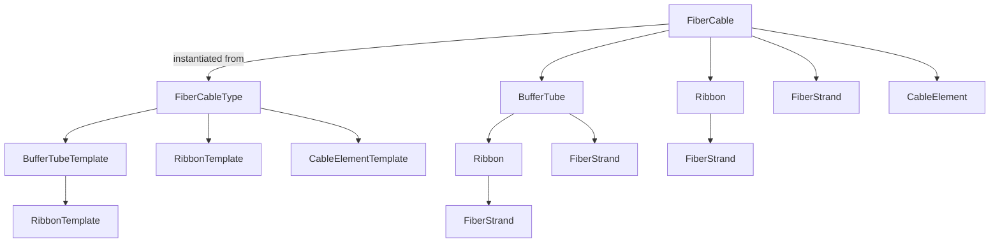
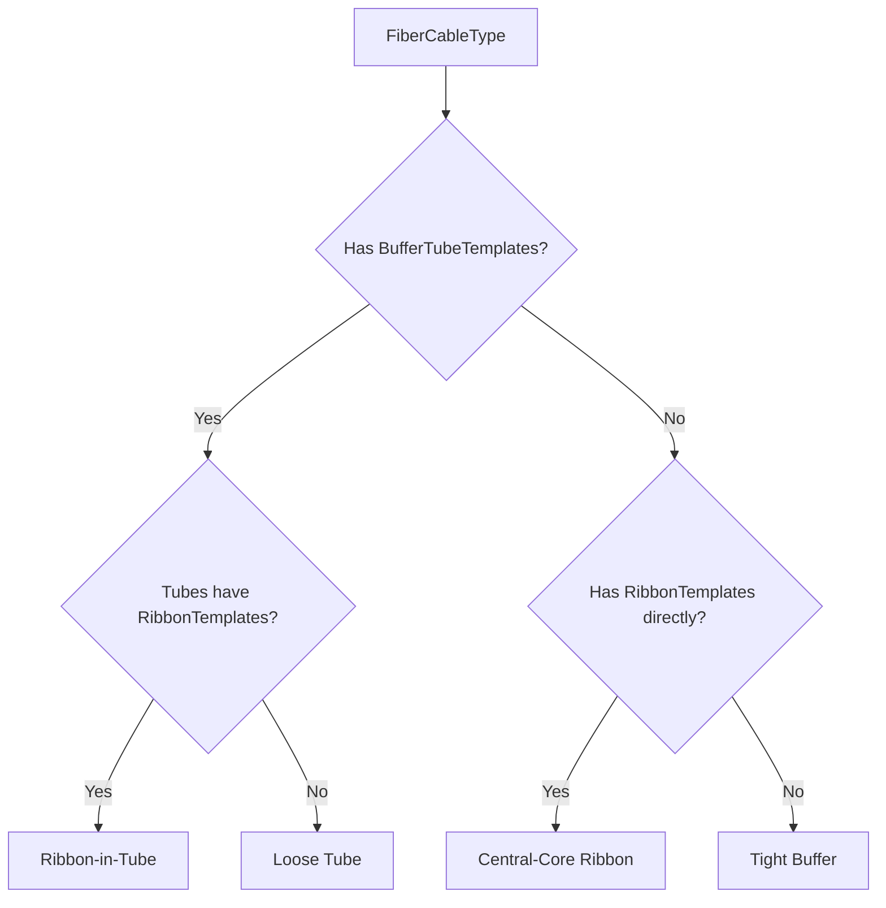

# Core Concepts

This page explains the foundational ideas behind NetBox FMS. Understanding these
concepts will help you model any fiber cable plant accurately, from simple
tight-buffer patch cords to high-density ribbon cables with hundreds of strands.

---

## The Type/Instance Pattern

NetBox FMS follows the same **Type/Instance** pattern that NetBox itself uses
for devices. In core NetBox, a **DeviceType** describes a model of equipment
(manufacturer, model number, port layout) while a **Device** is a specific
physical unit of that model installed at a site. The type is the blueprint; the
instance is the real thing.

NetBox FMS applies the same idea to fiber cables:

| Concept | Blueprint (Type) | Instance |
|---------|-------------------|----------|
| NetBox core | DeviceType | Device |
| NetBox FMS | **FiberCableType** | **FiberCable** |

### FiberCableType -- the Blueprint

A **FiberCableType** defines a cable's construction: how many tubes it has, how
many fibers per tube, whether it uses ribbons, and what non-fiber elements
(strength members, armor) are present. You create a FiberCableType once for each
distinct cable product you use, then reuse it every time you install that cable.

The blueprint is built from **component templates**:

- **BufferTubeTemplate** -- defines a buffer tube and its fiber count or ribbon
  children.
- **RibbonTemplate** -- defines a fiber ribbon (can be a child of a
  BufferTubeTemplate or attached directly to the FiberCableType).
- **CableElementTemplate** -- defines non-fiber elements such as strength
  members, ripcords, or armor.

### FiberCable -- the Instance

A **FiberCable** represents a specific physical cable installed in your network.
Each FiberCable is linked one-to-one with a NetBox `dcim.Cable` record, giving
it endpoints, length, and path information.

When a FiberCable is created, the plugin reads the associated FiberCableType and
**automatically instantiates** all internal components:

- **BufferTube** -- a physical tube inside the cable.
- **Ribbon** -- a fiber ribbon grouping multiple strands.
- **FiberStrand** -- an individual optical fiber, automatically colored using the
  EIA-598 standard.
- **CableElement** -- a non-fiber component (strength member, armor, etc.).

No manual creation of strands or tubes is required. The type defines the
structure; the instance builds it.

### Hierarchy Diagram

The diagram below shows how type-level templates map to instance-level
components.

**Left side (type level):** FiberCableType owns templates that describe the
cable's internal design. **Right side (instance level):** FiberCable owns the
actual components created from those templates.

---

## Four Construction Cases

Not all fiber cables are built the same way. NetBox FMS supports four distinct
construction styles, determined by which templates you attach to a
FiberCableType. The decision tree below shows how the plugin resolves the
construction case:

### 1. Loose Tube

BufferTubeTemplates with a `fiber_count` set produce FiberStrands directly
inside each BufferTube. This is the most common construction for outside-plant
cables.

**Example:** A 48-fiber loose-tube cable with 4 tubes, each containing 12
fibers. Create a FiberCableType with four BufferTubeTemplates, each with
`fiber_count=12`. When a FiberCable is created from this type, the plugin
generates 4 BufferTubes and 48 FiberStrands (12 per tube), each automatically
colored per EIA-598.

### 2. Ribbon-in-Tube

BufferTubeTemplates with RibbonTemplate children produce Ribbons inside each
BufferTube, with FiberStrands grouped inside those Ribbons. This construction is
used in high-density outside-plant cables.

**Example:** A 144-fiber ribbon-in-tube cable with 12 tubes, each containing a
single 12-fiber ribbon. Create a FiberCableType with 12
BufferTubeTemplates, each having a RibbonTemplate child with `strand_count=12`.
Instantiation produces 12 BufferTubes, 12 Ribbons (one per tube), and 144
FiberStrands (12 per ribbon).

### 3. Central-Core Ribbon

RibbonTemplates attached directly to the FiberCableType (with no
BufferTubeTemplates) produce Ribbons and FiberStrands without any surrounding
tube structure. This is common in high-density indoor/outdoor ribbon cables.

**Example:** A 288-fiber central-core ribbon cable with 24 ribbons of 12 fibers
each. Create a FiberCableType with 24 RibbonTemplates, each with
`strand_count=12`. No BufferTubeTemplates are needed. Instantiation produces 24
Ribbons and 288 FiberStrands.

### 4. Tight Buffer

When a FiberCableType has no BufferTubeTemplates and no RibbonTemplates, the
plugin creates FiberStrands directly on the FiberCable. This matches tight-buffer
construction used in indoor patch cords and short distribution cables.

**Example:** A 12-fiber tight-buffer indoor cable. Create a FiberCableType with
`fiber_count=12` and no tube or ribbon templates. Instantiation produces 12
FiberStrands attached directly to the FiberCable.

---

## EIA-598 Color Code

NetBox FMS automatically assigns colors to FiberStrands using the **TIA/EIA-598**
standard color code. You do not need to set strand colors manually -- they are
determined by the strand's position within its parent (tube, ribbon, or cable).

The 12 standard fiber colors are:

| Position | Color  | Hex Code  |
|----------|--------|-----------|
| 1        | Blue   | `#0000FF` |
| 2        | Orange | `#FF8000` |
| 3        | Green  | `#00FF00` |
| 4        | Brown  | `#8B4513` |
| 5        | Slate  | `#708090` |
| 6        | White  | `#FFFFFF` |
| 7        | Red    | `#FF0000` |
| 8        | Black  | `#000000` |
| 9        | Yellow | `#FFFF00` |
| 10       | Violet | `#EE82EE` |
| 11       | Rose   | `#FF69B4` |
| 12       | Aqua   | `#00FFFF` |

For cables with more than 12 fibers per group, the color sequence **cycles**.
Fiber 13 is Blue again, fiber 14 is Orange, and so on. Buffer tubes follow the
same color sequence for their own positions within the cable.

This automatic coloring ensures that every fiber in your documentation matches
the physical marking on the glass, eliminating a common source of human error in
splice records and strand assignments.
