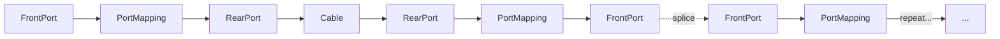

# Fiber Circuits

## Overview

A FiberCircuit represents an end-to-end logical service over fiber infrastructure, tracking the physical path from origin to destination. Fiber circuits tie together cables, port mappings, splice entries, and fiber strands into a single traceable entity with status lifecycle management and loss budget tracking.

## Data Model

### FiberCircuit

The top-level circuit object. Each FiberCircuit has a name, description, and a status that governs its lifecycle. It serves as the logical container for one or more paths that describe how light travels from origin to destination.

### FiberCircuitPath

An ordered sequence of nodes representing a route from origin to destination. Each path carries a `position` field for ordering, a `calculated_loss_db` field for computed optical loss, an `actual_loss_db` field for measured loss, and a `wavelength_nm` field for the operating wavelength.

### FiberCircuitNode

An individual hop within a path. Each node references the physical infrastructure at that point in the route:

| Field          | Description                                      |
|----------------|--------------------------------------------------|
| `cable`        | The `dcim.Cable` traversed at this hop           |
| `front_port`   | The `dcim.FrontPort` at entry or exit            |
| `rear_port`    | The `dcim.RearPort` at entry or exit             |
| `fiber_strand` | The `FiberStrand` carried through this segment   |
| `splice_entry` | The `SplicePlanEntry` joining two fibers         |

## Status Lifecycle

Fiber circuits follow a four-stage lifecycle:

| Status           | Description                                                        |
|------------------|--------------------------------------------------------------------|
| Planned          | Circuit has been designed but not yet staged for deployment.       |
| Staged           | Circuit is approved and ready for provisioning on the network.     |
| Active           | Circuit is live and carrying traffic.                              |
| Decommissioned   | Circuit has been taken out of service.                             |

## Path Trace Flow

The path tracing algorithm navigates the physical infrastructure graph by following port mappings and cable connections:

At each device, the trace follows the internal port mapping from FrontPort to RearPort, then crosses a cable to reach the RearPort on the next device, and maps back to a FrontPort. When a splice entry connects two FrontPorts, the trace crosses the splice and continues the pattern on the next segment.

## Circuit Provisioning Workflow

Provisioning a fiber circuit follows a four-step process:

1. **Select origin and destination devices.** Identify the endpoints that the circuit must connect.

2. **Discover candidate paths.** The `find_fiber_paths()` function performs a breadth-first search over the fiber infrastructure DAG, starting from the origin device and exploring all reachable routes toward the destination.

3. **Evaluate proposals.** The search returns ranked proposals that include available strand information for each segment. This allows the operator to choose a path based on strand availability, hop count, or expected loss.

4. **Create the circuit atomically.** Calling `create_circuit_from_proposal()` atomically creates the FiberCircuit, its FiberCircuitPath, and all FiberCircuitNode records in a single transaction. This ensures the circuit is either fully provisioned or not created at all.

## Path Tracing

The `trace_fiber_path()` function walks the physical graph starting from a given FrontPort:

1. Follow the internal port mapping from FrontPort to its paired RearPort.
2. Cross the cable connected to that RearPort, arriving at the RearPort on the remote device.
3. Follow the port mapping on the remote device from RearPort back to a FrontPort.
4. If a SplicePlanEntry connects this FrontPort to another FrontPort, cross the splice and repeat from step 1.
5. If no further connection exists, the trace terminates.

The algorithm maintains a set of visited nodes and terminates immediately if a loop is detected, preventing infinite traversal in misconfigured topologies.

## Loss Budgets

Each FiberCircuitPath carries two loss fields:

- **`calculated_loss_db`** — the computed optical loss for the route, based on fiber attenuation, splice losses, and connector losses along the path.
- **`actual_loss_db`** — the measured loss from OTDR or power meter testing in the field.

Comparing calculated and actual loss values helps identify anomalies such as bad splices or damaged fiber. Circuits whose loss exceeds the receiver sensitivity threshold for the deployed transceiver modules can be flagged for review before activation.
