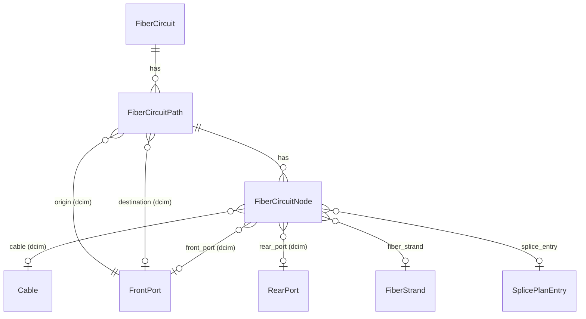

# Fiber Circuits

A **FiberCircuit** is the end-to-end logical service that runs over your
fiber plant. Where a `dcim.Cable` represents one physical span, a fiber
circuit ties together all of the spans, splices, and ports that carry one
service from origin to destination, with optional parallel paths for
diversity. Circuits are first-class NetBox objects with their own status
lifecycle, REST API, GraphQL type, change log, and search index.

The circuit subsystem has three responsibilities:

1. **Discovery.** Given two devices, find candidate paths through the fiber
   graph (cables + closures + existing splices), score them, and return
   ranked proposals.
2. **Provisioning.** Materialize a chosen proposal as a `FiberCircuit` plus
   one `FiberCircuitPath` per strand, atomically.
3. **Protection.** Once a circuit is active, prevent its underlying
   resources (cables, ports, strands, splice entries) from being deleted or
   re-spliced out from under it.

---

## Data model



### FiberCircuit

The top-level service object.

| Field           | Type                          | Notes                                                                |
| --------------- | ----------------------------- | -------------------------------------------------------------------- |
| `name`          | char(200)                     | Display name, required                                               |
| `cid`           | char(200)                     | External circuit identifier (work order, internal CID, etc.)         |
| `status`        | choice                        | `planned`, `staged`, `active`, `decommissioned`                      |
| `description`   | text                          | Free-form description                                                |
| `strand_count`  | positive int                  | Number of parallel strand paths the circuit reserves                 |
| `tenant`        | FK -> `tenancy.Tenant`        | Optional tenant attribution                                          |
| `comments`      | text                          | Long-form notes                                                      |

A circuit's `strand_count` caps how many `FiberCircuitPath` rows can hang
off it. Saving the circuit with `status=decommissioned` deletes all
`FiberCircuitNode` rows so the underlying objects are no longer protected.
Moving a decommissioned circuit back to any other status rebuilds nodes by
calling `FiberCircuitPath.rebuild_nodes()` from the stored path JSON.

### FiberCircuitPath

One strand's journey from origin to destination.

| Field                | Type                | Notes                                                |
| -------------------- | ------------------- | ---------------------------------------------------- |
| `circuit`            | FK -> `FiberCircuit` | Owning circuit                                       |
| `position`           | positive int        | 1-indexed ordering within the circuit                |
| `origin`             | FK -> `dcim.FrontPort` | Path entry point                                  |
| `destination`        | FK -> `dcim.FrontPort` | Path exit point (nullable for incomplete traces)  |
| `path`               | JSON list           | Ordered hop records (front_port / rear_port / cable / splice_entry) |
| `is_complete`        | bool                | `True` if the trace reached a destination            |
| `calculated_loss_db` | decimal(6,3)        | Optional design-time loss budget                     |
| `actual_loss_db`     | decimal(6,3)        | Optional measured loss (OTDR, power meter)           |
| `wavelength_nm`      | positive int        | Wavelength the loss values apply to; required if either loss is set |

`(circuit, position)` is unique. `clean()` enforces the strand-count cap and
that `wavelength_nm` is set whenever `calculated_loss_db` or `actual_loss_db`
is populated.

### FiberCircuitNode

A relational index of every object on a path. Each node references one of
`cable`, `front_port`, `rear_port`, `fiber_strand`, or `splice_entry` via
`on_delete=PROTECT`. This is what enforces circuit protection: as long as
the circuit is not decommissioned, deleting any of those underlying objects
raises `ProtectedError`.

Nodes are not edited directly. They are rebuilt automatically on path
retrace, on circuit status transitions, and during provisioning.

---

## Status lifecycle

| Status            | Meaning                                                                           |
| ----------------- | --------------------------------------------------------------------------------- |
| `planned`         | Circuit has been designed but not yet staged. Nodes exist; resources are protected. |
| `staged`          | Circuit is ready for cutover; pre-deployment activities are in progress.          |
| `active`          | Circuit is live and carrying traffic.                                             |
| `decommissioned`  | Circuit is no longer in service. Nodes are deleted; resources are no longer protected. |

There is no enforced state-machine: any transition is permitted, and the
side effects on `FiberCircuitNode` rows (delete on entering
`decommissioned`, rebuild on leaving) happen automatically in `save()`.

---

## Discovery: `find_fiber_paths()`

The discovery engine lives in `netbox_fms.provisioning`. The public entry
point is:

```python
from netbox_fms.provisioning import find_fiber_paths

proposals = find_fiber_paths(
    origin_device,
    destination_device,
    strand_count=1,
    priorities=None,            # default: ["hop_count", "new_splices",
                                #           "strand_adjacency", "lowest_strand"]
    max_results=20,
)
```

### Algorithm

1. **Build a device graph.** All cables that terminate on `RearPort`
   instances are collected. Each cable becomes a bidirectional edge between
   the two devices its rear ports belong to.
2. **Enumerate simple routes.** Depth-first search finds every simple path
   (no repeated devices) between origin and destination, up to a default
   max depth of 10.
3. **Compute hop availability.** For each hop along each route, look at the
   PortMappings on both ends and find the `RearPort` positions that have
   matching FrontPorts on entry and exit, with neither FrontPort already
   occupied (terminated by a non-zero-length cable).
4. **Generate candidates.** For single-hop routes, every group of
   `strand_count` available positions on the same cable is a candidate.
   For multi-hop routes, the engine builds chains: each chain enters a
   closure on one cable and exits on the next, with a splice (existing or
   to-be-created) at the intermediate device.
5. **Score and rank.** Each candidate is scored by the priority list in
   order. Lower is better.

### Scoring priorities

| Priority           | Meaning                                                          |
| ------------------ | ---------------------------------------------------------------- |
| `hop_count`        | Fewer cable spans win                                            |
| `new_splices`      | Reuse existing splices over creating new ones                    |
| `strand_adjacency` | Prefer strands that are contiguous within a cable                |
| `lowest_strand`    | Prefer lower-numbered strand positions (deterministic ordering)  |

Pass a different ordering or subset to change the ranking. For example, if
you care more about reusing splices than minimizing hops:

```python
proposals = find_fiber_paths(
    origin, dest, strand_count=2,
    priorities=["new_splices", "hop_count", "strand_adjacency"],
)
```

### Proposal shape

Each proposal is a dict:

```python
{
    "strands": [
        {
            "hops": [
                {
                    "cable_id": 42,
                    "fp_entry_id": 101,
                    "fp_exit_id": 105,
                    "entry_rp_id": 71,
                    "exit_rp_id": 72,
                    "position": 7,
                },
                # ...
            ],
            "position": 7,
        },
        # one entry per requested strand
    ],
    "route": [12, 34, 56],   # ordered device IDs
    "hop_count": 2,
    "new_splice_count": 1,
    "existing_splice_count": 0,
    "is_contiguous": True,
    "lowest_position": 7,
    "splices_needed": [
        {"device_id": 34, "fp_a_id": 105, "fp_b_id": 110},
    ],
}
```

---

## Provisioning: `create_circuit_from_proposal()`

Once a proposal is selected, materialize it atomically:

```python
from netbox_fms.provisioning import create_circuit_from_proposal

circuit = create_circuit_from_proposal(
    proposals[0],
    name="DC1-DC2 backbone A",          # or use name_template
    name_template="Circuit-{n}",        # auto-incrementing fallback
    splice_project=my_project,          # optional SpliceProject for new splices
)
```

Inside a single transaction, the helper:

1. Creates the `FiberCircuit` with `status=planned` and `strand_count`
   matching the number of strands in the proposal.
2. Creates one `FiberCircuitPath` per strand, populating `origin`,
   `destination`, `path` (the hop JSON), and `is_complete=True`.
3. Creates `FiberCircuitNode` rows for every front port, rear port, cable,
   and splice entry on the path, plus one node per `FiberStrand` derived
   from the path's front ports.
4. For each `splices_needed` entry, creates a zero-length `dcim.Cable` with
   `FrontPort` <-> `FrontPort` terminations (a splice cable) and a matching
   `SplicePlanEntry`. If `splice_project` is provided, a draft plan is
   created or reused for that closure under that project; otherwise the
   first existing plan on the closure is used.

If the transaction fails for any reason, no circuit, paths, nodes, splice
cables, or plan entries are created.

The classmethod helpers `FiberCircuit.find_paths()` and
`FiberCircuit.create_from_proposal()` proxy to the provisioning module if
you prefer the model-side API.

---

## Tracing and retracing

The trace engine lives in `netbox_fms.trace`. From a starting `FrontPort`
it walks the chain `FrontPort -> PortMapping -> RearPort ->
CableTermination -> Cable -> remote RearPort -> PortMapping -> FrontPort`,
crossing splices (`SplicePlanEntry`) when one is present. Loops are
detected and stop the trace.

`FiberCircuitPath.from_origin(front_port)` returns an unsaved path with
the trace populated. `FiberCircuitPath.retrace()` re-runs the trace from
`self.origin`, updates `path` / `destination` / `is_complete`, saves, and
either rebuilds protection nodes (active circuit) or deletes them
(decommissioned circuit).

The REST API exposes both:

```bash
# Per-path hop-by-hop trace with computed totals
GET /api/plugins/fms/fiber-circuit-paths/{id}/trace/

# Retrace every path on a circuit
POST /api/plugins/fms/fiber-circuits/{id}/retrace/
```

The trace endpoint returns `{circuit_id, circuit_name, path_position,
is_complete, hops, total_calculated_loss_db, total_actual_loss_db,
wavelength_nm}` along with hop records suitable for rendering in the UI's
trace view.

---

## Loss budgets

Each path tracks two loss values:

- **`calculated_loss_db`**: design-time estimate based on fiber attenuation
  per kilometer, splice losses, and connector losses.
- **`actual_loss_db`**: measured value from OTDR or power meter testing.

Both fields are decimal(6,3). When either is set, `wavelength_nm` is
required so the loss is interpretable. Compare planned versus measured
loss to spot bad splices or damaged fiber, or to validate that the circuit
is within receiver sensitivity for the deployed transceivers.

The plugin does not currently compute losses automatically: enter the
calculated value manually based on your loss budget tooling, then update
`actual_loss_db` after field testing.

---

## Circuit protection

Circuit protection is what stops you from breaking a live service while
modifying NetBox. Every object on a non-decommissioned circuit's path has a
matching `FiberCircuitNode` with `on_delete=PROTECT`, so:

- Deleting a `dcim.Cable` referenced by an active path raises
  `ProtectedError`.
- Deleting a `FrontPort` or `RearPort` carrying an active circuit raises
  `ProtectedError`.
- Bulk-updating splice plan entries that touch a protected fiber returns
  HTTP 409 with a body listing the conflicting circuit names. See
  `/api/plugins/fms/splice-plans/{id}/bulk-update/` and the closure
  Pending Work tab for the user-facing surface.

The dedicated endpoint `GET /api/plugins/fms/fiber-circuits/protecting/`
takes one or more of `cable=`, `front_port=`, `rear_port=`,
`fiber_strand=`, or `splice_entry=` (comma-separated IDs) and returns the
circuits whose paths reference any of them. Use it to surface "which
circuits would be affected" in dashboards or pre-flight checks.

To take resources out from under protection, set the circuit to
`decommissioned`. The `save()` override deletes its `FiberCircuitNode`
rows in the same transaction.

---

## Common workflows

### Provision a new dark-fiber circuit between two POPs

```python
from dcim.models import Device
from netbox_fms.provisioning import find_fiber_paths, create_circuit_from_proposal

origin = Device.objects.get(name="POP-A-CLOSURE")
dest   = Device.objects.get(name="POP-B-CLOSURE")

proposals = find_fiber_paths(origin, dest, strand_count=2,
                             priorities=["hop_count", "new_splices"])
best = proposals[0]
circuit = create_circuit_from_proposal(best, name="POP-A <-> POP-B (Pair 1)")
```

### Cut a circuit over to a new path

1. Create the new circuit with `create_circuit_from_proposal()`. It enters
   `planned` status, so its nodes are protected immediately.
2. Verify the new path with `POST .../{id}/retrace/`.
3. Decommission the old circuit (set status to `decommissioned`). Its
   protection nodes are deleted, freeing the previously held splices.
4. Set the new circuit to `active`.

### Inventory all circuits affected by a planned outage

```bash
curl -s -H "Authorization: Token $TOKEN" \
  "$NETBOX_URL/api/plugins/fms/fiber-circuits/protecting/?cable=42,43,44"
```

The response is a standard fiber-circuit list, suitable for a customer
notification spreadsheet or a maintenance ticket.
