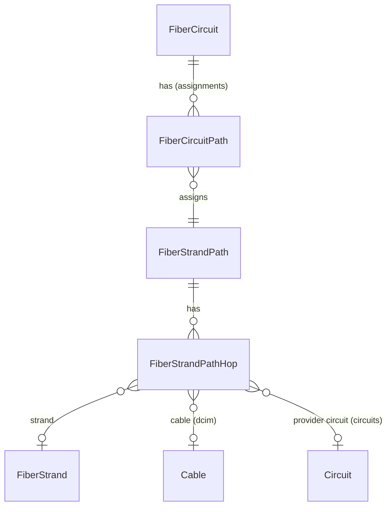

# Fiber Circuits

A **FiberCircuit** is the end-to-end logical service that runs over your
fiber plant. Where a `dcim.Cable` represents one physical span, a fiber
circuit ties together all of the spans, splices, and ports that carry one
service from origin to destination. Circuits are first-class NetBox objects
with their own status lifecycle, REST API, change log, and search index.

Circuits do not trace or store paths themselves. A background
[path analysis](path-analysis.md) derives every fiber path from the plant,
and a circuit **assigns** analyzed paths. The circuit subsystem has three
responsibilities:

1. **Assignment.** Pick analyzed paths for a circuit (wizard, "Assign fibers"
   action, or API).
2. **Change detection.** When the plant changes under an assigned path, mark
   the circuit broken until the new route is authorized or acknowledged.
3. **Protection.** Prevent anything on an active assignment from being
   deleted out from under the service.

---

## Data model


```mermaid
erDiagram
    FiberCircuit ||--o{ FiberCircuitPath : "has (assignments)"
    FiberCircuitPath }o--|| FiberStrandPath : assigns
    FiberStrandPath ||--o{ FiberStrandPathHop : has
    FiberStrandPathHop }o--o| FiberStrand : strand
    FiberStrandPathHop }o--o| Cable : "cable (dcim)"
    FiberStrandPathHop }o--o| Circuit : "provider circuit (circuits)"
```

### FiberCircuit

The top-level service object.

| Field           | Type                   | Notes                                                              |
| --------------- | ---------------------- | ------------------------------------------------------------------ |
| `name`          | char(200)              | Display name, required                                             |
| `cid`           | char(200)              | External circuit identifier (work order, internal CID, etc.)       |
| `status`        | choice                 | `planned`, `staged`, `active`, `decommissioned`                    |
| `description`   | text                   | Free-form description                                              |
| `strand_count`  | positive int           | Number of paths the circuit may assign                             |
| `tenant`        | FK -> `tenancy.Tenant` | Optional tenant attribution                                        |
| `is_broken`     | bool (read-only)       | True while any active assignment is broken; maintained by the analysis |
| `comments`      | text                   | Long-form notes                                                    |

### FiberCircuitPath (an assignment)

One circuit's use of one analyzed path. Assignments are created only by
assigning (see below) and deleted to unassign.

| Field                  | Notes                                                                                   |
| ---------------------- | --------------------------------------------------------------------------------------- |
| `circuit`, `position`  | Owning circuit and 1-indexed order; unique together                                     |
| `strand_path`          | The analyzed path (`FiberStrandPath`)                                                   |
| `active`               | False once the circuit is decommissioned                                                |
| `assigned_hops`        | Snapshot of the path's hops taken at assignment (updated by acknowledging or authorizing) |
| `delivered_incomplete` | The path was assigned although not terminated at both ends                              |
| `is_broken`, `broken_reason` | See "Broken circuits"                                                             |
| `wavelength_nm`, `actual_loss_db` | Measured loss and its wavelength; the only fields editable after assignment  |

A path can have at most one active assignment.

---

## Status lifecycle

| Status           | Meaning                                                                          |
| ---------------- | -------------------------------------------------------------------------------- |
| `planned`        | Circuit has been designed but not yet staged. Its assignments protect their plant. Proposed (planned) plant may be assigned. |
| `staged`         | Circuit is ready for cutover; pre-deployment activities are in progress.         |
| `active`         | Circuit is live and carrying traffic.                                            |
| `decommissioned` | Circuit is no longer in service. Assignments are deactivated and stop protecting. |

There is no enforced state machine; any transition is permitted, with the
side effects described under "Decommissioning".

---

## Assigning fibers

There are three entry points, all using the same picker.

**Circuit wizard** (the Circuit Wizard button on the Fiber Circuits list). Creates the circuit and assigns
its paths in one transaction.

**"Assign fibers" action** on a circuit's page. The same picker for an
existing circuit.

**API:**

```
POST /api/plugins/fms/fiber-circuits/{id}/assign/
{"strand_paths": [101, 102], "allow_incomplete": false}
-> 201 [ {assignment}, {assignment} ]
```

`strand_paths` is the ordered list of `fiber-strand-paths` ids; each becomes
one assignment, in that order. A refusal is HTTP 400 with the problems listed
under `strand_paths`, and nothing is assigned.

### The picker

The picker offers **groups** of paths: as many paths as the circuit still
needs (the strand count), all on one route. Filters:

- **Ends at** -- devices the path must end on.
- **Must pass through** -- an ordered device list.
- **Avoid devices, cables, sites, tenants** -- exclude any path touching them.
- **Allow incomplete paths** -- also offer paths not terminated at both ends
  (for example a hand-off to another owner in a shared structure). Such
  assignments are flagged `delivered_incomplete`.

Groups are ranked by contiguity first (adjacent strands in the same buffer
tube on every cable of the route), then fewer hops, then lowest strand
position. Defective paths are never offered; proposed paths only when the
circuit's status is `planned`. Paths already assigned are not offered.

### Rules

An assignment is refused when:

- the circuit is decommissioned;
- it would exceed the circuit's `strand_count`;
- a path already has an active assignment (one active assignment per path);
- a path is not terminated at both ends and `allow_incomplete` is off;
- a path is listed twice.

### Permissions

Assigning (UI and API) needs `change` on the circuit plus `add` on fiber
circuit paths, and honors object-permission constraints on both.
Acknowledging a route needs `change` on the circuit and `change` on the
broken assignments. Creating a circuit through the wizard also needs `add` on
fiber circuits.

---

## Broken circuits

Whenever the analysis re-walks a path with an active assignment, it compares
the path's hops with `assigned_hops`. **Any** difference -- a hop lost, added
or replaced, complete path or not -- marks the assignment broken:

| `broken_reason` | Meaning                                                  |
| --------------- | -------------------------------------------------------- |
| `hops_changed`  | The path still exists but follows different hops         |
| `path_lost`     | The path has no hops left (its strands or cables are gone) |

`FiberCircuit.is_broken` is true while any active assignment is broken. It is
a real field on the circuit, saved with a change-log entry only when it
flips, so NetBox event rules and webhooks can notify on the transition.
(Banners and notification screens beyond the field and the change log are
separate work.)

### Authorized changes

A **RouteChangeAuthorization** records that an approved change may re-route a
circuit. When the analysis finds the circuit's hops changed and an
authorization exists, and the first and last strand hops are unchanged (same
end strands on the same devices), it accepts the new hops as the assignment,
keeps the circuit healthy, and consumes the authorization. Today only
**slack-loop insertion** into a closure writes one, for the circuits riding
the cut cable. Splice plan authorization is future work.

!!! note
    Slack-loop insertion clears the circuits' broken state automatically only
    when the assigned path also crosses other cables. A path made of the cut
    cable alone loses its hops with the cable and becomes `path_lost`; it
    needs acknowledging.

### Acknowledging

Anything not authorized stays broken until a user accepts the new route:
**Acknowledge route** on the circuit's page, or

```
POST /api/plugins/fms/fiber-circuits/{id}/acknowledge-route/
-> {"acknowledged": 2, "is_broken": false}
```

Acknowledging sets each broken assignment's `assigned_hops` to the current
hops and clears the flags. It does not recover a `path_lost` assignment
whose path has no hops: that assignment is skipped and stays broken (and so
does the circuit), and `acknowledged` counts only the assignments accepted.
Unassign it (delete the assignment) and assign a current path instead.

---

## Decommissioning

Setting a circuit to `decommissioned` deactivates its assignments (`active`
becomes false), so nothing they cover is protected any more and the paths can
be assigned to other circuits. Moving the circuit back out of
`decommissioned` reactivates its assignments and re-evaluates them against
the current plant (the circuit may come back broken). Reactivation is refused
while another circuit has since assigned one of the paths.

Unassigning a single path is deleting its assignment.

---

## Provider spans

Leased dark fiber often rides a provider's circuit between two meet-me
rooms. Model that span as a core `circuits.Circuit` with two terminations,
and cable your trunk rear ports to the terminations like any other cable
end:

```
RearPort -> Cable -> CircuitTermination (A)
                        [Circuit DF-001, Provider X]
RearPort <- Cable <- CircuitTermination (Z)
```

The analysis crosses the circuit as a single opaque hop and keeps walking on
the far side. Back-to-back circuits chain. The intent is deliberately narrow:
**document that a fiber circuit crosses a provider circuit, not the provider's
infrastructure.**

Each `FiberCircuit` maintains an automatically synced `provider_circuits`
relation from the hops of its active assignments (never edited by hand):

```bash
# All fiber circuits riding any circuit of provider 7
GET /api/plugins/fms/fiber-circuits/?provider_id=7

# All fiber circuits riding core circuit 42
GET /api/plugins/fms/fiber-circuits/?provider_circuit_id=42

# Same question through the protecting endpoint
GET /api/plugins/fms/fiber-circuits/protecting/?provider_circuit=42
```

The provider span contributes no calculated loss; record measured end-to-end
loss in `actual_loss_db`.

---

## Loss budgets

Each assignment carries:

- **`calculated_loss_db`**: read-only, computed over the strand hops of the
  assigned path from each FiberCableType's per-wavelength attenuation specs
  (dB/km) and each cable's `glass_length`. It is a list of
  `[wavelength_nm, loss_db]` pairs, one per wavelength the specs cover.
- **`actual_loss_db`**: the measured value from OTDR or power meter testing.
  Requires `wavelength_nm`.

Compare planned against measured loss to spot bad splices or damaged fiber,
or to validate the circuit against receiver sensitivity. Provider spans and
plain-cable hops add no calculated loss.

---

## Circuit protection

Protection stops you from breaking a live service while modifying NetBox. An
object is protected while it is part of an **active** assignment. Deletion is
refused (`ProtectedError`, or an error message in the UI) for:

- a **strand** that is a hop of an active assignment;
- a **cable** that is a hop, or carries a strand that is a hop;
- a **provider circuit** that is a hop;
- a **front port** that is an end of an active assignment, or that has such a
  strand landed on it (this also stops a device delete that would cascade
  into one).

An unassigned path never blocks deletion; the next analysis simply updates
or removes it. Splice plans touching protected fibers cannot be applied:
`/api/plugins/fms/splice-plans/{id}/bulk-update/` returns HTTP 409 listing
the conflicting circuit names, and the closure Pending Work tab shows the
same.

### The protecting endpoint

`/api/plugins/fms/fiber-circuits/protecting/` answers "which circuits would be
affected" for dashboards and pre-flight checks. It understands six reference
types: `cable`, `fiber_strand`, `provider_circuit`, `front_port`, `rear_port`
and `splice_entry`. `rear_port` and `splice_entry` resolve through the front
ports of the assignments.

**GET** takes reference IDs as query parameters -- comma-separated
(`?cable=42,43`), repeated (`?cable=42&cable=43`), or both -- and returns a
flat list of the circuits that reference any of them:

```
GET /api/plugins/fms/fiber-circuits/protecting/?cable=42,43&front_port=7
-> [ {circuit}, {circuit}, ... ]
```

**POST** is the bulk maintenance-impact interface. The body maps reference
types to ID lists, with no practical limit on set size. The response carries
the deduplicated affected circuits once, in `results`, plus a `by_reference`
breakdown mapping every input ID to the IDs of the circuits it affects --
references that touch no circuit map to an empty list:

```
POST /api/plugins/fms/fiber-circuits/protecting/
{"cable": [42, 43, 44], "front_port": [7]}
->
{
  "results": [ {circuit 10}, {circuit 11} ],
  "by_reference": {
    "cable": {"42": [10], "43": [10, 11], "44": []},
    "front_port": {"7": [11]}
  }
}
```

Unknown reference types, non-list values, and non-integer IDs return HTTP 400
naming the offending key. Although POST is normally a write verb, here it is
a pure read: it requires `view_fibercircuit` (not `add`), object-level
constraints filter both `results` and `by_reference`, and read-only API tokens
may call it.

---

## Common workflows

### Provision a new dark-fiber circuit between two POPs

1. Make sure the plant is modeled (cables, closures, splices). The analysis
   picks up changes within the batching window; check **FMS > Path Analysis >
   Fiber Paths** to see the derived paths.
2. Use the Circuit Wizard button on the Fiber Circuits list, enter the circuit details and strand
   count, set the ends (and any must-pass-through or avoid filters), and
   choose the top-ranked group.
3. The circuit and its assignments are created together.

For an existing circuit, use **Assign fibers** on its page or the `assign`
API action.

### Cut a circuit over to a new path

1. Create the new circuit and assign its paths. Its status is `planned`, so
   it protects its plant immediately and may use proposed plant.
2. Check the assigned paths on the new circuit's page.
3. Decommission the old circuit. Its assignments deactivate, freeing its
   paths.
4. Set the new circuit to `active`.

### Recover from a broken circuit

1. Find broken circuits (the `is_broken` field on the API, or an event rule on
   the circuit update).
2. Open the circuit; each broken assignment shows its `broken_reason`.
3. If the change is expected, **Acknowledge route**. If a path was lost,
   unassign it and assign a current path.

### Inventory all circuits affected by a planned outage

For a few resources, the GET form returns a standard fiber-circuit list:

```bash
curl -s -H "Authorization: Token $TOKEN" \
  "$NETBOX_URL/api/plugins/fms/fiber-circuits/protecting/?cable=42,43,44"
```

For a real maintenance event, POST the whole set at once and read the
combined impact from a single response:

```bash
curl -s -X POST -H "Authorization: Token $TOKEN" \
  -H "Content-Type: application/json" \
  -d '{"cable": [42, 43, 44, 45, 46, 47, 48, 49, 50, 51, 52, 53]}' \
  "$NETBOX_URL/api/plugins/fms/fiber-circuits/protecting/"
```

`results` is the deduplicated circuit list for the notification;
`by_reference` tells you which input cable drives which impact, and which
cables in the window carry nothing.
