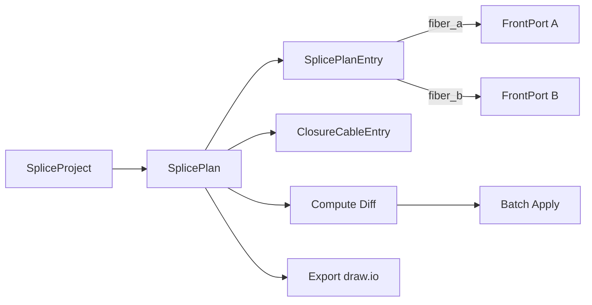
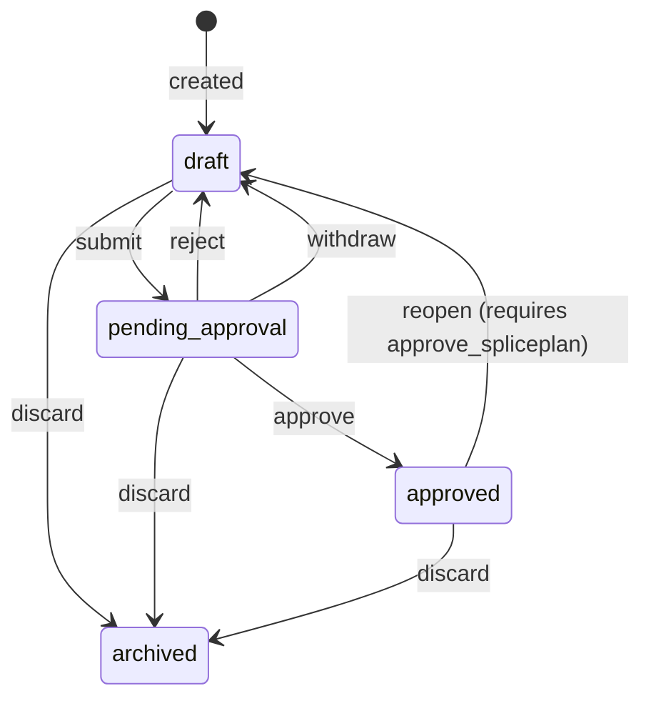

# Splice Planning

## Overview

Splice planning in NetBox FMS provides a structured workflow for designing, reviewing, approving, and applying fiber splice configurations on closure devices. The workflow moves from initial design through an approval gate, with optional parallel planning across multiple projects, culminating in a batch apply operation that commits planned splices to the active network state.

The splice planning system follows a hierarchical model:

## Core Objects

### SpliceProject

A SpliceProject is a grouping container for related splice plans. It is used to organize plans by project, deployment phase, or any other logical boundary. For example, a campus fiber buildout might have one SpliceProject containing all splice plans for that deployment, while a maintenance window might use a separate project to group its rework plans.

### SplicePlan

A SplicePlan represents the intended splice configuration for a single closure device. Each plan links to a `dcim.Device` (the closure) and carries a status that governs its lifecycle. See [Splice Plan Lifecycle](#splice-plan-lifecycle) for the full state machine and allowed transitions.

### SplicePlanEntry

A SplicePlanEntry maps one fiber to another within a splice plan. Each entry defines:

- **tray** -- the `dcim.Module` (splice tray) owning fiber A; the canonical tray for this entry.
- **fiber_a** -- a `dcim.FrontPort` representing one side of the splice.
- **fiber_b** -- a `dcim.FrontPort` representing the other side of the splice.
- **is_express** -- marks a fiber that passes through the closure without being physically spliced.
- **change_note** -- a required message describing why this entry was added or modified in the current editing session.

Both FrontPorts must belong to the plan's closure device, and the tray must match fiber A's parent module -- so every fiber used in a plan must first be assigned to a tray module (see [Preparing a Closure](#preparing-a-closure)).

Each entry corresponds to a single physical fiber splice. A plan typically contains many entries, one for every fiber pair that will be spliced at the closure.

Entries can only be added or removed while the plan is in **draft** status. Once a plan is submitted for approval, all entries are locked.

### ClosureCableEntry

A ClosureCableEntry manages cable gland and entrance assignments on closure devices. Each entry links a FiberCable to a specific entrance label on the closure, establishing which physical cable enters the closure at which port or gland position. This information is used during splice planning to identify which fibers are available at the closure and during draw.io export to label cable entrances on the diagram. A given FiberCable can be registered only once per closure, and a ClosureCableEntry must exist before that cable's buffer tubes can be assigned to trays.

### TrayProfile

A TrayProfile is an overlay on a `dcim.ModuleType` declaring it as splice hardware. It carries two attributes:

- **tray_role** -- either **Splice Tray** (holds splices; accepts tube assignments) or **Express Basket** (pass-through slack storage; does not accept tube assignments).
- **max_fibers** -- the number of splice positions in the tray, used by tube auto-assignment to respect capacity.

Modules installed in a closure are only treated as trays when their module type has a TrayProfile.

### TubeAssignment

A TubeAssignment routes one BufferTube to one splice tray (a `dcim.Module`) inside a closure. Validation enforces that:

- the tray belongs to the closure device,
- the tray's module type has a TrayProfile with the **Splice Tray** role (express baskets are rejected),
- the tube's fiber cable has a ClosureCableEntry on the closure, and
- each tube is assigned to at most one tray per closure.

Deleting a ClosureCableEntry automatically removes that cable's TubeAssignments on the closure.

---

## Preparing a Closure

Before a closure device can host splice plans, it needs its physical structure modeled. This mirrors the setup performed once per closure in the field:

1. **Create the closure device and its trays** in one step via **FMS > Add Splice Closure**: pick the device type and role, a splice tray module type and count, and optionally an express basket. The wizard creates the device with "Tray 1..N" (and "Basket 1..N") module bays and installed modules atomically. Prerequisite (once per hardware model): a `dcim.DeviceType` for the closure and tray `dcim.ModuleType`s marked with a **TrayProfile** (role and capacity). The closure can also be assembled manually from those same primitives.
2. **Terminate cables and provision ports.** Link each incoming cable's topology (see [Fiber Cables](fiber-cables.md#linking-cable-topology)) so every strand has a FrontPort on the closure. Splice plan entries require each fiber's FrontPort to belong to a tray module.
3. **Register cable entrances.** Create a **ClosureCableEntry** per cable, recording its gland or entrance label.
4. **Assign tubes to trays.** Create **TubeAssignments** manually or use the auto-assign action on the closure's Fiber Overview tab, which pairs same-position tubes from different cables onto the same tray while capacity allows.

Once this structure exists, plans can be authored, reviewed, and applied against the closure.

---

## Splice Plan Lifecycle

### State Machine

Each SplicePlan moves through a defined set of statuses. The allowed transitions are:

### Status Descriptions

| Status               | Description                                                                                                              |
|----------------------|--------------------------------------------------------------------------------------------------------------------------|
| **draft**            | The plan is being authored. Entries can be freely added, modified, or removed. The visual editor is fully interactive.   |
| **pending_approval** | The plan has been submitted for review and is locked. `submitted_by` records the user who submitted it. No edits are permitted until the plan is approved, rejected, or withdrawn. |
| **approved**         | The plan has passed review and is eligible for batch apply. The plan is locked. An approver can send it back to draft (reopen) if further changes are required. |
| **archived**         | The plan is a read-only historical record. No transitions out of archived are permitted.                                 |

### Transitions

| Action       | From                  | To                 | Who can perform                                    |
|--------------|-----------------------|--------------------|----------------------------------------------------|
| submit       | draft                 | pending_approval   | Any user with edit access to the plan              |
| approve      | pending_approval      | approved           | User with `approve_spliceplan` permission          |
| reject       | pending_approval      | draft              | User with `approve_spliceplan` permission          |
| withdraw     | pending_approval      | draft              | The user recorded in `submitted_by`                |
| reopen       | approved              | draft              | User with `approve_spliceplan` permission          |
| discard      | draft, pending_approval, approved | archived | Any user with edit access to the plan        |

Archiving is irreversible. Use it to close out plans that will never be applied, rather than deleting them, so that the planning history is preserved.

---

## Multiple Plans per Closure

Multiple SpliceProjects (and their plans) can target the same closure device at the same time. This is intentional: different teams or work orders may need to plan changes to the same closure in parallel without waiting for each other to finish.

Each SplicePlan targets exactly one closure. When the closure's Pending Work tab is viewed, all approved plans for that closure are displayed together and their diffs are combined for the batch apply operation.

Because multiple plans can claim fibers on the same closure concurrently, fiber exclusivity rules prevent conflicting plans from being submitted.

---

## Fiber Exclusivity

A given FrontPort (fiber) may only appear in the entries of one non-archived plan per closure at any time. This prevents two plans from silently assigning the same physical fiber to different splices.

**Rule:** A FrontPort cannot be referenced (as `fiber_a` or `fiber_b`) in entries of two different plans that are both in `draft`, `pending_approval`, or `approved` status and that target the same closure.

Exclusivity is enforced in two places:

1. **Model validation** (`SplicePlanEntry.clean()`) -- raised when saving an entry that conflicts with an existing non-archived plan.
2. **API bulk operations** (`bulk_update_entries`) -- the same check is applied before any batch update is committed.

When a conflict is detected, the error message identifies the conflicting plan by name and status so the user can resolve the overlap before proceeding.

To resolve a conflict, either archive the competing plan or remove the conflicting entry from it.

---

## Approval Workflow

### The `approve_spliceplan` Permission

The `approve_spliceplan` permission controls who can act as an approver. Users with this permission can:

- Approve a plan (pending_approval -> approved)
- Reject a plan (pending_approval -> draft)
- Reopen an approved plan (approved -> draft)

Assign this permission to leads, network engineers, or anyone responsible for validating splice designs before they are applied to the network.

### Submitting a Plan for Review

Once a plan in draft status is complete:

1. Open the plan's detail page.
2. Click **Submit for Approval**.
3. The plan transitions to `pending_approval` and is locked. Your username is recorded in `submitted_by`.

Reviewers are notified through normal NetBox change-log mechanisms; the plugin does not send external notifications.

### Approving or Rejecting

An approver opens the plan and chooses:

- **Approve** -- transitions the plan to `approved`. The plan is now eligible for batch apply.
- **Reject** -- transitions the plan back to `draft` with a comment. The original author can make changes and resubmit.

### Withdrawing a Submission

The user who submitted a plan (recorded in `submitted_by`) can withdraw it at any time while it is in `pending_approval`. Withdrawal returns the plan to `draft` without requiring approver action. This is useful when the submitter notices an error before review is complete.

---

## Required Changelog Messages

Every time entries are saved in the visual editor, a changelog message is required. This message is stored as the `change_note` field on each affected entry.

- The save confirmation modal will not proceed until a non-empty message is provided.
- The message should describe the reason for the change (e.g., "Corrected fiber assignments per updated reel map" or "Added fibers 13-24 for building C lateral").
- Changelog messages are displayed on the plan's apply page so reviewers and field technicians can understand what changed and why.

This requirement applies to all entry saves regardless of the plan's status, although entries can only be written while the plan is in draft.

---

## Batch Apply

Approved plans are not applied individually. Instead, applying happens from the closure device's **Pending Work** tab.

1. Navigate to the closure device in NetBox.
2. Open the **Pending Work** tab.
3. All approved plans targeting that closure are listed, and their diffs are combined into a single consolidated view.
4. Click **Apply All** to commit the changes.

The Apply All action:

- Creates splice cables for all entries marked as added across all approved plans.
- Removes splice cables for all entries marked as removed.
- Leaves unchanged splices in place.
- Operates atomically: if any part of the operation fails, no changes are committed.

After a successful apply, the plans involved are transitioned to `archived` to preserve the historical record.

---

## Diff Computation

The `compute_diff()` method compares the planned splice state against the actual (currently applied) state of the closure. The diff produces three categories:

- **Added** -- splices that exist in the plan but not in the current configuration. These will be created when the plan is applied.
- **Removed** -- splices that exist in the current configuration but are absent from the plan. These will be deleted when the plan is applied.
- **Unchanged** -- splices that match between the plan and the current configuration. These require no action.

Running a diff before applying provides a clear summary of what will change, reducing the risk of unintended modifications. The diff is visible on both the plan detail page and the closure's Pending Work tab.

---

## Visual Editor

The visual editor is the primary interface for authoring splice plan entries. Its behavior depends on the current plan status.

### Draft Plans (Editable)

When the plan is in `draft` status the editor is fully interactive:

- Drag fiber endpoints to create or reassign splices.
- Click an existing splice line to remove it.
- Click **Save** to open the confirmation modal, enter a required changelog message, and commit the entries.

### Non-Draft Plans (Read-only)

When the plan is in `pending_approval`, `approved`, or `archived` status, the editor switches to read-only mode. No drag-and-drop interactions are available. This prevents accidental edits to plans that are under review or have been approved.

### Ghost Lines (Concurrent Plan Visibility)

When other non-archived plans claim fibers on the same closure, the editor renders those fiber assignments as grey dashed lines ("ghost lines"). Ghost lines are not interactive and cannot be selected or modified. Hovering over a ghost line shows a tooltip identifying which plan has claimed that fiber.

Ghost lines allow a planner to see the full fiber utilization picture for the closure -- including work in progress by other teams -- without exposing the details of competing plans in an editable form.

---

## Draw.io Export

The `generate_drawio()` function creates an mxGraph XML file suitable for opening in draw.io or diagrams.net. The export includes:

- **Per-tray pages** -- each splice tray in the closure is rendered as a separate page in the diagram.
- **EIA-598 color coding** -- fiber strands are drawn using their standard EIA-598 color assignments for easy visual identification.
- **Diff annotations** -- fibers and splices are annotated to indicate whether they are added, removed, or unchanged relative to the current configuration.

The exported file can be shared with field technicians, attached to work orders, or archived alongside the splice plan for documentation purposes.
