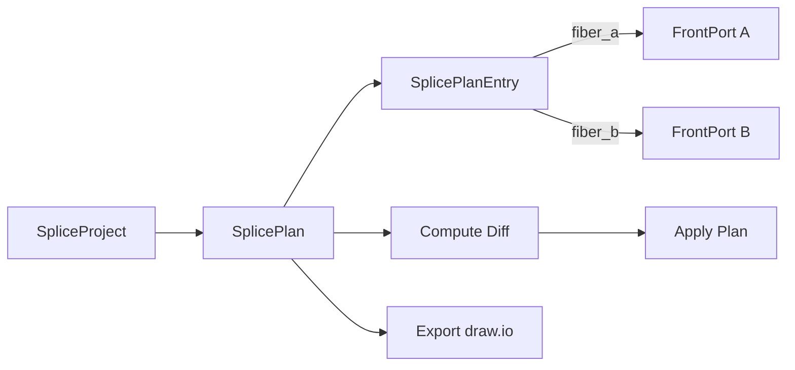

# Splice Planning

## Overview

Splice planning in NetBox FMS provides a structured workflow for designing, reviewing, and applying fiber splice configurations on closure devices. The workflow moves from initial design through review and approval, culminating in the application of planned splices to the active network state.

The splice planning system follows a hierarchical model:

## Core Objects

### SpliceProject

A SpliceProject is a grouping container for related splice plans. It is used to organize plans by project, deployment phase, or any other logical boundary. For example, a campus fiber buildout might have one SpliceProject containing all splice plans for that deployment, while a maintenance window might use a separate project to group its rework plans.

### SplicePlan

A SplicePlan represents the splice configuration for a single closure device. Each plan links to a `dcim.Device` and carries a status that governs its lifecycle:

| Status              | Description                                                                                          |
|---------------------|------------------------------------------------------------------------------------------------------|
| **Draft**           | The plan is being authored. Entries can be freely added, modified, or removed.                       |
| **Pending Review**  | The plan is complete and awaiting review. No further edits should be made until the review concludes. |
| **Ready to Apply**  | The plan has been reviewed and approved. It is staged for application to the active configuration.    |
| **Applied**         | The planned splices have been committed as the active configuration on the closure device.            |

A plan progresses through these statuses in order. Moving a plan backward (for example, from Pending Review back to Draft) is permitted when revisions are needed.

### SplicePlanEntry

A SplicePlanEntry maps one fiber to another within a splice plan. Each entry defines:

- **fiber_a** -- a `dcim.FrontPort` representing one side of the splice.
- **fiber_b** -- a `dcim.FrontPort` representing the other side of the splice.

Each entry corresponds to a single physical fiber splice. A plan typically contains many entries, one for every fiber pair that will be spliced at the closure.

### ClosureCableEntry

A ClosureCableEntry manages cable gland and entrance assignments on closure devices. Each entry links a FiberCable to a specific entrance label on the closure, establishing which physical cable enters the closure at which port or gland position. This information is used during splice planning to identify which fibers are available at the closure and during draw.io export to label cable entrances on the diagram.

## Diff Computation

The `compute_diff()` method compares the planned splice state against the actual (currently applied) state of the closure. The diff produces three categories:

- **Added** -- splices that exist in the plan but not in the current configuration. These will be created when the plan is applied.
- **Removed** -- splices that exist in the current configuration but are absent from the plan. These will be deleted when the plan is applied.
- **Unchanged** -- splices that match between the plan and the current configuration. These require no action.

Running a diff before applying a plan provides a clear summary of what will change, reducing the risk of unintended modifications.

## Applying a Plan

When a plan's status transitions to Applied, the planned splices become the active configuration on the closure device. The application process reconciles the planned state with the current state: new splices are created, removed splices are deleted, and unchanged splices are left in place. Once applied, the plan serves as a historical record of the change.

## Draw.io Export

The `generate_drawio()` function creates an mxGraph XML file suitable for opening in draw.io or diagrams.net. The export includes:

- **Per-tray pages** -- each splice tray in the closure is rendered as a separate page in the diagram.
- **EIA-598 color coding** -- fiber strands are drawn using their standard EIA-598 color assignments for easy visual identification.
- **Diff annotations** -- fibers and splices are annotated to indicate whether they are added, removed, or unchanged relative to the current configuration.

The exported file can be shared with field technicians, attached to work orders, or archived alongside the splice plan for documentation purposes.
