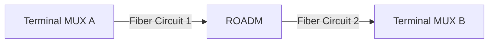

# Wavelength Services

## Overview

A **Wavelength Service** represents a logical optical service riding on fiber infrastructure through one or more WDM nodes. While a [Fiber Circuit](fiber-circuits.md) models a physical strand-level path from origin to destination, a Wavelength Service models a specific lambda (wavelength) carried on those strands and multiplexed/demultiplexed at WDM nodes along the route.

A typical wavelength service chains together:

- **WDM nodes** at each site, with a channel reserved at the service's wavelength.
- **Fiber circuits** between those nodes, carrying the multiplexed signal over physical strands.

In this example, a wavelength service at 1550.12 nm would claim one channel at each of the three WDM nodes and reference the two fiber circuits connecting them.

---

## How Wavelength Services Differ from Fiber Circuits

| Aspect | Fiber Circuit | Wavelength Service |
|--------|--------------|-------------------|
| **Layer** | Physical strand | Logical wavelength on a strand |
| **Scope** | Single end-to-end fiber path | End-to-end service spanning multiple fiber circuits and WDM nodes |
| **Granularity** | One strand per circuit | One lambda per service, multiplexed with others on the same strand |
| **Provisioning** | Assign strands and trace cable paths | Assign channels at WDM nodes and link fiber circuits between them |

A single fiber circuit may carry dozens of wavelength services simultaneously through WDM. The wavelength service tracks which channel on each WDM node belongs to a particular service.

---

## Data Model

### WavelengthService

The top-level service object.

| Field | Description |
|-------|-------------|
| **Name** | Unique service identifier. |
| **Wavelength (nm)** | The ITU wavelength this service operates on (e.g., 1550.12). |
| **Status** | Lifecycle status (see below). |
| **Tenant** | Optional tenant assignment for multi-tenant environments. |
| **Description** | Free-text description. |

### WavelengthServiceChannelAssignment

Links the service to a **WavelengthChannel** at a WDM node, with a **sequence** number that defines the order of the channel in the end-to-end path.

### WavelengthServiceCircuit

Links the service to a **FiberCircuit** between WDM nodes, with a **sequence** number that defines where it falls in the path.

### WavelengthServiceNode

A relational index that enforces deletion protection. When a wavelength service references a channel or fiber circuit, that channel or circuit cannot be deleted until the service releases it. This prevents accidental removal of infrastructure that is backing an active service.

---

## Status Lifecycle

Wavelength services follow a four-stage lifecycle, matching the pattern used by [Fiber Circuits](fiber-circuits.md#status-lifecycle):

| Status | Description |
|--------|-------------|
| **Planned** | Service has been designed but not yet provisioned. Channels and circuits can be freely modified. |
| **Staged** | Service is approved and ready for activation. |
| **Active** | Service is live and carrying traffic. Referenced channels are marked as Lit and protected from reassignment. |
| **Decommissioned** | Service has been taken out of service. All channels are released back to Available status. |

### Decommissioning

When a service transitions to Decommissioned:

1. All `WavelengthServiceNode` protection records are deleted.
2. All referenced `WavelengthChannel` records are set back to Available status.

This frees the channels for reuse by other services. The service record itself is retained as a historical record.

If a decommissioned service is moved back to an earlier status, its protection nodes are rebuilt from the current channel and circuit assignments.

---

## Creating a Wavelength Service

1. Navigate to **FMS > Wavelength Services** and click **Add**.
2. Set the **Name**, **Wavelength (nm)**, **Status**, and optionally a **Tenant**.
3. Save the service.

### Assigning Channels at WDM Nodes

After creating the service, add channel assignments to define which WDM nodes participate:

1. On the service detail page, add **Channel Assignments**.
2. For each assignment, select:
   - **Channel** -- a WavelengthChannel on a WDM node that matches the service's wavelength.
   - **Sequence** -- an integer defining the order of this node in the end-to-end path (e.g., 1 for the origin terminal mux, 2 for an intermediate ROADM, 3 for the destination terminal mux).

### Assigning Fiber Circuits Between Nodes

Add circuit assignments to link the fiber paths between WDM nodes:

1. On the service detail page, add **Circuit Assignments**.
2. For each assignment, select:
   - **Fiber circuit** -- the FiberCircuit connecting two adjacent WDM nodes.
   - **Sequence** -- an integer that interleaves with the channel assignments to form the complete path.

A typical ordering pattern for a three-node service:

| Sequence | Type | Reference |
|----------|------|-----------|
| 1 | Channel | Terminal MUX A, channel C32 |
| 2 | Circuit | Fiber circuit between MUX A and ROADM |
| 3 | Channel | ROADM, channel C32 |
| 4 | Circuit | Fiber circuit between ROADM and MUX B |
| 5 | Channel | Terminal MUX B, channel C32 |

---

## Protection

Active wavelength services protect the infrastructure they depend on:

- **Channels** referenced by an active service have their status set to Lit. The [ROADM Editor](roadm-editor.md) displays these channels with a lock icon and the service name, preventing reassignment.
- **Fiber circuits** referenced by an active service cannot be deleted due to the `WavelengthServiceNode` PROTECT constraint.

This ensures that operational services are not disrupted by accidental changes to the underlying infrastructure.

---

## Validation Rules

The `clean()` method on WavelengthService enforces two consistency checks:

1. **Grid consistency** -- all WDM nodes referenced through channel assignments must use the same grid (e.g., all DWDM 100 GHz). Mixing grids within a single service is not permitted.
2. **Wavelength consistency** -- each assigned channel's wavelength must match the service's wavelength within a tolerance of 0.01 nm. This prevents accidentally assigning a C32 channel to a service defined at a C33 wavelength.

These validations run on save and will reject the operation with a descriptive error if either check fails.

---

## Stitched Trace View

The service detail page includes a **Trace** tab that renders the end-to-end path by interleaving channel and circuit assignments in sequence order. The `get_stitched_path()` method produces an ordered list of hops:

- **WDM node hops** show the node name, channel label, and wavelength.
- **Fiber circuit hops** show the circuit name.

This provides a single view of the complete optical path from origin to destination, spanning both the physical fiber layer and the WDM channel layer.
